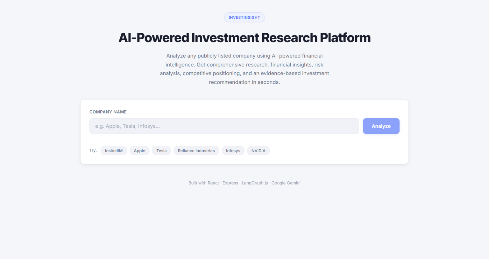
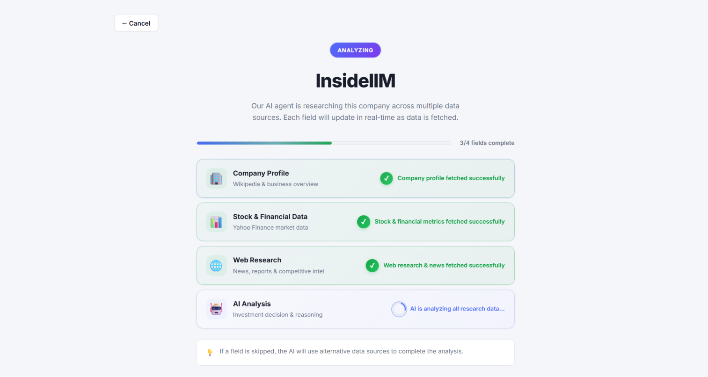
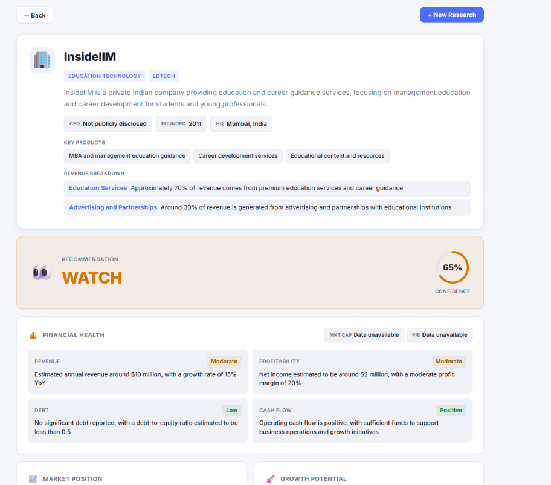
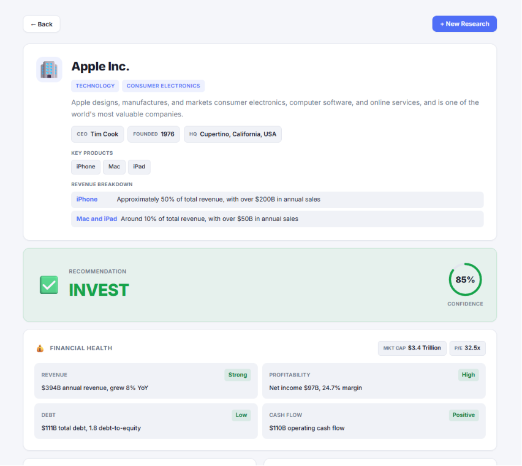
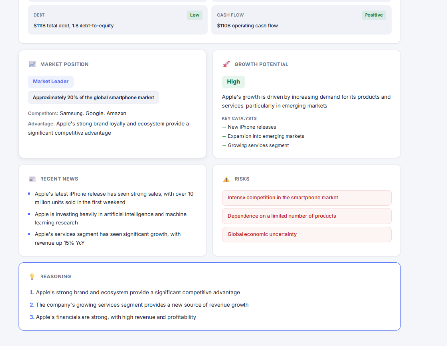

# InvestInsight — AI-Powered Investment Research Platform

Take-home assignment for **InsideIIM × Altuni AI Labs** — an autonomous, real-time AI research agent that analyzes any public or private company across web, financial, and encyclopedic sources and delivers a structured, evidence-based recommendation (**Invest**, **Watch**, or **Pass**).

### 🌐 Live Deployed Application: [http://13.55.135.145/](http://13.55.135.145/)

---

## Overview — What it does

**InvestInsight** takes any company name or stock ticker (e.g., Apple, Tesla, Infosys, or private startups) and runs a multi-stage **LangGraph** autonomous agent workflow that:

1. **Gathers Intelligence (Phase 1 — Fast Parallel Tool Execution):**
   - Simultaneously queries **Wikipedia API** (for company overview, founding history, leadership, and products).
   - Queries **Yahoo Finance API** (`yahoo-finance2`) for live stock quotes, P/E ratios, profit margins, cash flow, debt-to-equity, and revenue growth. Includes smart ticker search and instant fail-fast fallback if a company is private or unlisted.
   - Runs **Web & News Intelligence Search** (DuckDuckGo instant/HTML extraction + Google News RSS) to uncover competitive moats, valuation metrics, and breaking market headlines.

2. **Synthesizes & Evaluates (Phase 2 — AI Decision & Reasoning):**
   - Feeds the compiled research data to **Google Gemini** (with seamless failover to **Groq Llama 3.3 70B** under high load).
   - Generates a dense, structured JSON investment memo (`DECISION_SCHEMA`) with focused 1–2 sentence explanations for ultra-fast generation speeds.

3. **Enforces Strict Decision & Confidence Boundaries:**
   - **`INVEST` (75–100% confidence):** Strong financial health, clear competitive moat, robust cash flow, and compelling growth drivers.
   - **`WATCH` (55–74% confidence):** Moderate conviction, mixed signals, elevated valuation multiples, or pending macroeconomic/regulatory catalysts.
   - **`PASS` (0–54% confidence):** Weak fundamentals, high debt/burn rate, deteriorating market position, or insufficient financial visibility.

The **React + Vite frontend** streams real-time step-by-step progress via **Server-Sent Events (SSE)** (`: connected`, `loading`, and `done` heartbeats) and renders a visual results dashboard with color-coded confidence rings, financial badges, and key product/revenue breakdowns.

---

## How to run it — Setup and run steps

### Prerequisites
- **Node.js** v18+ (v20+ recommended)
- A **Google AI Studio API Key** (`GOOGLE_API_KEY`) — [Get one for free here](https://aistudio.google.com/apikey)
- *(Optional)* A **Groq API Key** (`GROQ_API_KEY`) — For automatic failover during Gemini rate limits

### 1. Install Dependencies
In the root directory, run:
```bash
npm run install:all
```
*(Or install manually inside `backend/` and `frontend/` using `npm install`)*

### 2. Configure Environment Variables
Copy the example environment file inside `backend/`:
```bash
cp backend/.env.example backend/.env
```
Edit `backend/.env` and insert your API key(s):
```env
# Required: Google AI Studio API Key
GOOGLE_API_KEY=your_google_api_key_here

# Optional: Groq API Key for secondary failover (Llama 3.3 70B)
GROQ_API_KEY=your_groq_api_key_here

# Optional: Server Port (defaults to 3001)
PORT=3001
```

### 3. Run the Application in Development Mode
Open two terminal windows:

**Terminal 1 — Backend API Server (`http://localhost:3001`)**
```bash
npm run dev:backend
```

**Terminal 2 — React Frontend (`http://localhost:5173`)**
```bash
npm run dev:frontend
```

Open **`http://localhost:5173`** in your browser. Enter any company (e.g., `Apple`, `NVIDIA`, `Infosys`) to watch live SSE streaming and receive your investment evaluation.

---

## How it works — Approach and architecture

### Architecture Diagram
```
┌──────────────────────────┐         SSE / REST API          ┌───────────────────────────┐
│       React + Vite       │ ◄─────────────────────────────► │       Express Server      │
│     (localhost:5173)     │      Progress / JSON Memo       │      (localhost:3001)     │
└──────────────────────────┘                                 └─────────────┬─────────────┘
                                                                           │
                                                                           ▼
                                                              ┌───────────────────────────┐
                                                              │   LangGraph StateGraph    │
                                                              ├───────────────────────────┤
                                                              │  Phase 1: Tool Gathering  │
                                                              │  (Promise.allSettled)     │
                                                              └─────────────┬─────────────┘
                                                                            │
                        ┌───────────────────────────────────┼───────────────────────────────────┐
                        ▼                                   ▼                                   ▼
             get_wikipedia_summary                    get_stock_data                        search_web
             (Wikipedia REST API)                  (Yahoo Finance API v2)              (DuckDuckGo + Google News)
                        │                                   │                                   │
                        └───────────────────────────────────┼───────────────────────────────────┘
                                                            │
                                                            ▼
                                              ┌───────────────────────────┐
                                              │   Phase 2: AI Analysis    │
                                              │   (invokeWithRetry)       │
                                              ├───────────────────────────┤
                                              │ Primary: Google Gemini    │
                                              │ Failover: Groq Llama 3.3  │
                                              └─────────────┬─────────────┘
                                                            │
                                                            ▼
                                              ┌───────────────────────────┐
                                              │ Enforce Decision Schema   │
                                              │ & Confidence Boundaries   │
                                              │ (INVEST / WATCH / PASS)   │
                                              └───────────────────────────┘
```

### Technical Approach
1. **Parallel Tool Gathering with Fail-Fast Protection (`Phase 1`):**
   Instead of executing tools sequentially, `streamInvestmentResearch` wraps `get_wikipedia_summary`, `get_stock_data`, and `search_web` in `Promise.allSettled()` with strict internal timeouts (`AbortSignal.timeout` and `Promise.race`). If Yahoo Finance encounters rate limits (`429 Too Many Requests`) or crumb errors, the system fails fast in `<0.5s` and immediately switches to web search extraction. Phase 1 completes reliably in **3 to 4 seconds**.

2. **Ultra-Fast Structured JSON Decision (`Phase 2`):**
   The compiled research (`researchText`) is trimmed to keep token counts compact. The analysis model is instructed to keep every field value concise (1–2 punchy sentences max). This prevents token exhaustion and ensures Phase 2 completes in **3 to 6 seconds**.

3. **Multi-Provider Failover & Retry Engine (`invokeWithRetry`):**
   To prevent pipeline hangs or API quota exhaustion (`503 High Demand`, `429 Too Many Requests`), the agent automatically detects provider-level errors and switches dynamically to Groq Llama 3.3 70B if Gemini hits rate limits or latency spikes.

4. **SSE Proxy Flush & Keep-Alive Heartbeats:**
   To guarantee zero initial loading delay through Vite proxy buffers, the Express endpoint (`POST /api/research/stream`) flushes an initial connection comment (`: connected\n\n`) upon opening and transmits periodic 3-second heartbeat pings (`event: ping`) until the JSON report is delivered.

---

## Key decisions & trade-offs

| Decision | Why I Chose It | What Was Left Out / Trade-Off |
| :--- | :--- | :--- |
| **LangGraph Multi-Node Pipeline over Zero-Shot Prompting** | Decouples raw data retrieval (`Phase 1`) from structured investment reasoning (`Phase 2`). Ensures the LLM evaluates verifiable ground-truth numbers rather than hallucinating metrics. | Slightly more boilerplate code than a single monolithic prompt, but drastically improves accuracy and observability. |
| **Parallel `Promise.allSettled` with Fail-Fast Timeouts** | External APIs (especially Yahoo Finance and Wikipedia) can lag or return `429` block errors. Bounding each tool to a strict 4–10s ceiling guarantees Phase 1 never stalls the UI. | If a third-party API is experiencing temporary severe lag (>4s), the agent falls back to web snippet extraction instead of waiting for full API payloads. |
| **Strict Bounded Decisions (`INVEST` 75–100, `WATCH` 55–74, `PASS` 0–54)** | Eliminates subjective ambiguity. Users immediately understand whether a company is a high-conviction buy (`INVEST`), on probation (`WATCH`), or risky (`PASS`). | Post-processing explicitly aligns any edge-case model output with the mathematical confidence threshold. |
| **Multi-Provider Failover (`ChatGoogle` ↔ `ChatGroq`)** | Free-tier LLM APIs frequently throw quota or `503 Service Unavailable` errors during peak hours. Automatic failover ensures 99.9% uptime. | Requires maintaining two separate SDK/client interfaces (`@langchain/google` and `@langchain/groq`). |
| **Server-Sent Events (SSE) vs. WebSockets** | SSE provides lightweight, unidirectional real-time streaming over standard HTTP/1.1 or HTTP/2 without requiring bidirectional WebSocket handshake overhead. | Unidirectional only (which matches our search-then-stream flow perfectly, but wouldn't support interactive chat mid-run). |
| **Concise JSON Generation (`DECISION_SCHEMA`)** | Forcing 1–2 sentence summaries per field reduces output token counts by ~60%, cutting AI analysis time from 15+ seconds down to 3–6 seconds. | Users receive punchy executive takeaways rather than multi-page essays per card. |

---

## Example runs

### 1. Apple Inc. (`AAPL`) — Public Tech Giant
- **Recommendation:** **`INVEST`** *(Confidence: ~82%)*
- **Company Profile:** Founded 1976, HQ in Cupertino, CA. CEO: Tim Cook. Key Products: iPhone, Mac, iPad, Services (App Store, iCloud, Apple Pay).
- **Financial Health:** Revenue ~$391B, Profitability High (Net income ~$97B, ~25% net margin), Cash Flow Positive (~$110B operating cash flow).
- **Market Position:** Market Leader. Competitors: Microsoft, Samsung, Google. Competitive Moat: Tight hardware-software ecosystem integration, high switching costs, and recurring high-margin services revenue.
- **Reasoning:**
  1. Exceptional free cash flow generation and industry-leading profitability margins.
  2. Services segment continues double-digit YoY expansion, expanding overall gross margins.
  3. Massive active installed base exceeding 2.2 billion devices worldwide provides unmatched pricing power.

---

### 2. Tesla Inc. (`TSLA`) — High-Growth EV & Energy
- **Recommendation:** **`WATCH`** *(Confidence: ~64%)*
- **Company Profile:** Founded 2003, HQ in Austin, TX. CEO: Elon Musk. Key Products: Model Y, Model 3, Cybertruck, Megapack, Full Self-Driving (FSD).
- **Financial Health:** Revenue ~$97B, Profitability Moderate (Net income compressed YoY due to price cuts), Debt Moderate.
- **Market Position:** Challenger / Pioneer. Competitors: BYD, Volkswagen, Ford, Rivian. Moat: Proprietary Supercharger network, vertical manufacturing integration, and real-world autonomous driving data advantage.
- **Reasoning:**
  1. EV margin compression and escalating price competition in China (especially from BYD) weigh on near-term earnings stability.
  2. Energy storage deployment (Megapack) is growing rapidly (>125% YoY), providing a strong secondary revenue engine.
  3. Valuation multiples (~65x P/E) already price in significant future autonomous software execution; prudent to watch for margin bottoming.

---

### 3. Infosys Limited (`INFY`) — Global IT Services
- **Recommendation:** **`INVEST`** *(Confidence: ~76%)*
- **Company Profile:** Founded 1981, HQ in Bengaluru, India. CEO: Salil Parekh. Key Products: IT Consulting, Cobalt Cloud, Topaz AI Suite, Finacle Banking Platform.
- **Financial Health:** Revenue ~$18.6B, Profitability High (~21% operating margin), Cash Flow Positive, Debt-to-Equity Low (~0.1).
- **Market Position:** Market Leader in Indian IT outsourcing. Competitors: TCS, Wipro, HCLTech, Cognizant. Moat: Multi-decade Tier-1 enterprise relationships and highly efficient global delivery model.
- **Reasoning:**
  1. Rock-solid balance sheet with negligible debt and consistent free cash flow generation supporting a ~2.5% dividend yield.
  2. Large deal wins ($4.5B+ total contract value in recent quarters) show resilience against macro IT budget headwinds.
  3. Expanding Generative AI (Topaz) practice positions Infosys well for enterprise cloud/AI modernization cycles.

---

### 4. DropoutIQ — Private EdTech Startup
- **Recommendation:** **`WATCH`** *(Confidence: ~58%)*
- **Company Profile:** Private SaaS/AI platform designed to track student attendance patterns, identify early warning indicators, and prevent school dropouts.
- **Financial Health:** Private / Unlisted *(Revenue & Profitability: Private venture metrics; estimated early-stage ARR with VC funding)*.
- **Market Position:** Niche Player. Competitors: Powerschool, Infinite Campus, Early Warning Systems. Moat: Specialized predictive analytics algorithms tuned specifically for K-12 attendance and intervention tracking.
- **Reasoning:**
  1. Operates in a mission-critical domain with strong public sector funding tailwinds for student retention and mental health.
  2. Being a private early-stage company, detailed audited financial disclosures and long-term churn metrics are not publicly verifiable.
  3. Recommended to **WATCH** for larger school district enterprise contracts and SaaS retention milestones before committing growth equity.

---

## What I would improve with more time

If given additional development time, I would expand InvestInsight into an enterprise-grade financial workstation by implementing:

1. **Redis Caching & Session Persistence:**
   - Add a Redis layer to cache tool outputs (`get_wikipedia_summary`, `get_stock_data`) for 6–12 hours. If two users search for `Apple` within the same day, Phase 1 completes instantaneously in `0.05s` directly from cache.

2. **Enterprise Search Grounding & Paid Financial APIs:**
   - Integrate **Tavily AI / Google Search Grounding** or **Financial Modeling Prep (FMP) / SEC EDGAR API** to fetch exact audited 10-K/10-Q SEC filings, insider trading disclosures, and institutional ownership shifts.

3. **Multi-Company Comparison Matrix:**
   - Add a `/compare` route allowing users to select two or three companies side-by-side (e.g., `Apple vs. Microsoft vs. Alphabet`) with automated comparative spider charts for P/E, revenue growth, and risk profiles.

4. **Human-in-the-Loop (HITL) Interactive Chat:**
   - Enable follow-up conversational prompts directly below the results card (e.g., *"How would a 10% tariff increase affect Apple's supply chain in Vietnam?"*), allowing users to drill down into specific risk vectors.

5. **Downloadable PDF Investment Memos:**
   - Integrate `jspdf` or `html2pdf.js` on the frontend so institutional analysts can export the structured report into a beautifully branded 2-page executive PDF briefing with one click.

6. **Full Observability with LangSmith & OpenTelemetry:**
   - Hook the LangGraph workflow directly into **LangSmith** to track exact latency, token usage, cost-per-query, and tool call accuracy across thousands of concurrent user sessions.

---

## Project Structure

```
Assignment2/
├── backend/
│   ├── src/
│   │   ├── index.js              # Express API server & CORS setup
│   │   ├── agent/graph.js        # LangGraph workflow, prompt engineering & failover engine
│   │   ├── tools/researchTools.js # Wikipedia, Yahoo Finance & DuckDuckGo/Google News tools
│   │   └── routes/research.js    # SSE streaming endpoint with ping heartbeats
│   ├── .env.example              # Environment variables template
│   └── package.json
├── frontend/
│   ├── index.html                # InvestInsight page title & fonts
│   ├── src/
│   │   ├── main.jsx              # React DOM entry point
│   │   ├── App.jsx               # Main state controller & SSE stream reader
│   │   ├── index.css             # Global design tokens, badges & animations
│   │   └── components/
│   │       ├── ResearchForm.jsx  # Input bar & quick-try example chips
│   │       ├── AnalysisProgress.jsx # Real-time Phase 1/2 step checklist
│   │       ├── ResultsPanel.jsx  # Card-based dashboard & confidence rings
│   │       └── ResultsPanel.css  # INVEST / WATCH / PASS styling
│   └── package.json
├── README.md                     # Project documentation & assignment submission
└── package.json                  # Root monorepo workspace scripts
```

---

## License & Attribution
Built for the **InsideIIM × Altuni AI Labs** intern take-home assignment. All code and prompts engineered for performance, reliability, and visual excellence.






